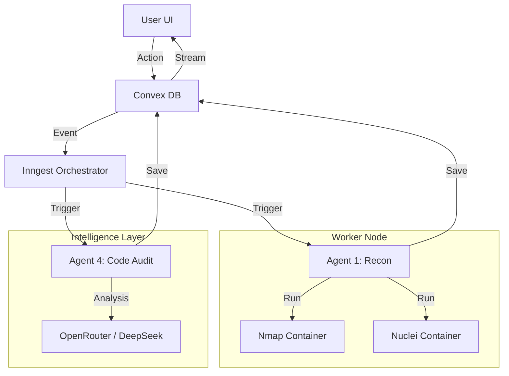

# MIKKY OS 🛡️
### AI-Powered Offensive Security Operations Center

> **"The Matrix has you... unless you hack it first."** 🕶️

   

---

## ⚡ Quick Start

```bash
# 1. Install & Setup
git clone https://github.com/Neoujne/mikky-os.git
cd mikky-os
npm install
cp .env.example .env

# 2. Terminal A (The Bridge)
npx ngrok http 5000
# -> Copy the forwarding URL (e.g., https://a1b2.ngrok-free.app)

# 3. Terminal B (The System)
cd mikky-os-frontend
npx convex env set MIKKY_BACKEND_URL [PASTE_URL_HERE]
cd ..
npm run dev:all
```

---

## 🔰 Absolute Beginner's Guide

New to development? Follow these steps to get Mikky OS running on your machine.

### 1. Install Prerequisites
You need these tools installed on your computer first:

- **Node.js**: The engine that runs the code.
  - [Download Node.js](https://nodejs.org/) (Choose "LTS")
  - *Verify*: Open terminal and type `node -v`

- **Git**: To download the source code.
  - [Download Git](https://git-scm.com/downloads)
  - *Verify*: Open terminal and type `git --version`

- **Docker Desktop**: Required for security scanners.
  - [Download Docker](https://www.docker.com/products/docker-desktop/)
  - *Important*: Open Docker Desktop after installing and let it run in the background.

- **Ngrok**: Required to expose the backend to the cloud database.
  - [Sign up & Install Ngrok](https://ngrok.com/download)
  - *Verify*: Open terminal and type `ngrok version`

### 2. Get the Code & Install
Open a terminal (Terminal 1) and run:

```bash
git clone https://github.com/Neoujne/mikky-os.git
cd mikky-os
npm install
```

### 3. Configuration
Mikky OS needs API keys.

**Create Settings File:**
```bash
cp .env.example .env
```
*(Windows users: manually rename `.env.example` to `.env` if the command fails)*

**Add Keys:** Open `.env` and fill in:
- `OPENROUTER_API_KEY`: [Get API Key](https://openrouter.ai/) (For AI Chat)
- `CLERK_PUBLISHABLE_KEY`: [Get Keys](https://clerk.com/) (For Login)
- `CONVEX_DEPLOYMENT`: Run `npx convex dev` to set this up automatically.

### 4. Launch Protocol (The Tunnel)
We need to connect your local backend to the internet.

1. Open a **NEW Terminal** (Terminal A).
2. Run this command to start the tunnel:
   ```bash
   npx ngrok http 5000
   ```
3. Look for the **Forwarding** line. It will look like: `https://a1b2-c3d4.ngrok-free.app`.
4. **Copy that URL.** Keep this terminal open!

### 5. Launch System (The Brain)
1. Go back to your **FIRST Terminal** (Terminal B).
2. Tell the database where your tunnel is (replace `[PASTE_URL]` with your copied URL):
   ```bash
   cd mikky-os-frontend
   npx convex env set MIKKY_BACKEND_URL [PASTE_URL]
   cd ..
   ```
3. Start the system:
   ```bash
   npm run dev:all
   ```
4. Open `http://localhost:5173` in your browser.

---

## 🌆 The Vibe

Mikky OS isn't just a tool; it's an experience. Toggle between **Cyberpunk Mode** (Neon Cyan/Purple, Matrix rain aesthetics) and **Stealth Mode** (Green/Black terminal vibes) instantly. 

Designed for the Vibeathon, it merges high-end UI engineering with ruthless backend efficiency.

---

## 🚀 Features

### 🕸️ Network Recon & Surveillance
Active monitoring engine that orchestrates **Nmap**, **Masscan**, and **Subfinder** to map attack surfaces in real-time. Results are streamed live to your dashboard via WebSockets.

### 🧪 Vulnerability Lab
Integrated **Nuclei** engine capabilities. Detects CVEs, misconfigurations, and exposed panels. The system automatically categorizes findings by severity (CRITICAL to INFO).

### 🤖 Source Code Audit [NEW]
**AI-Driven SAST Engine**. Give it a GitHub URL, and Mikky OS will:
1. Fetch the repository structure via GitHub API.
2. Identify high-risk files (Auth, API, Crypto).
3. "Read" the code using Large Language Models (LLMs).
4. Produce a detailed vulnerability report with fixed code snippets.

### 💬 AI Security Consultant [NEW]
**Interactive Remediation Chat**. Found a vulnerability? Don't just stare at it. chat with the **AI Security Consultant** directly in the audit dashboard.
- *"How do I fix this SQL Injection?"*
- *"Explain why this regex is dangerous."*
The AI analyzes the specific finding and provides tailored, copy-pasteable fixes.

---

## 🏗️ Architecture

Event-Driven Architecture powered by **Inngest** for reliable orchestration.



---

## 🛠️ Tech Stack

| Component | Technology | Description |
|-----------|------------|-------------|
| **Frontend** | React, Vite | High-performance UI with Framer Motion |
| **Styling** | TailwindCSS | Cyberpunk & Stealth theming |
| **Backend** | Node.js, Express | Robust API layer |
| **Database** | Convex | Real-time state synchronization |
| **Orchestrator** | Inngest | Durable execution workflows |
| **AI** | OpenRouter | DeepSeek R1, Gemini 1.5 Pro |
| **Infrastructure** | Docker | Ephemeral security containers |

---

## 📂 Project Structure

```bash
mikky-os/
├── mikky-os-frontend/    # React SPA (Vite)
├── mikky-os-backend/     # Express API + Inngest
├── mikky-os-worker/      # Docker environments
└── convex/               # Database Schema & Functions
```

---

*Built for the Vibeathon. Hacking the planet, one repo at a time.* 💀
